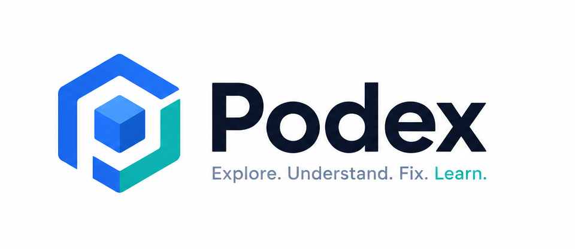

<p align="center">
  
  <h1 align="center">Podex</h1>
</p>

<p align="center">
  <b>Learn Kubernetes by understanding your own cluster.</b>
</p>

<p align="center">
  <a href="https://podex.in">Website</a>
  ·
  <a href="https://podex.in/docs">Documentation</a>
  ·
  <a href="https://github.com/Hritikraj8804/podex/issues">Report Bug</a>
</p>

<p align="center">
  
  
  
  
  
</p>

---

Podex is an **open-source, AI-powered Kubernetes workspace** for beginners, students, and developers. It acts as a local mentor that explains concepts, aggregates context, and troubleshoots failures in plain English  all through a visual, desktop-like interface.

### ✨ Features

| Capability | Description |
|------------|-------------|
| **Visual Dashboard** | Live cluster health, pod status matrix, stat cards, needs-attention panel |
| **Cluster Explorer** | Browse 9 resource types  Pods, Deployments, Services, Nodes, ConfigMaps, Secrets, StatefulSets, DaemonSets, Events  with search, filter, bulk delete, real-time WebSocket updates |
| **Topology Diagram** | Pan/zoom column map (Ingress → Service → Deployment → Pod) with drag-repositioning |
| **Arena Playground** | Drag-and-drop canvas to model K8s architectures; auto-generates clean YAML |
| **Poddy AI Tutor** | ChatGPT-style chat for K8s questions with analogies, gotchas, and deep explanations |
| **AI Investigation** | One-click pod diagnosis  specs + logs + events → root cause + fix |
| **Live Terminal & Logs** | WebSocket shell, SSE log streaming, natural-language kubectl command generator |
| **Port Forwarding** | One-click forward to Pods and Services from the Explorer table |
| **Explain Before Execute** | Educational modals for destructive ops (rolling updates, SIGTERM, scaling) |
| **Sandbox Mode** | Runs fully mock-mode out of the box  no API keys needed |

---

### 🏗️ Architecture

```
┌──────────────┐      REST / SSE / WebSocket      ┌──────────────────┐
│  React 19    │  ◄────────────────────────────►  │  FastAPI Backend │
│  Vite        │                                  │  Python          │
│  Tailwind v4 │                                  └──────┬───────────┘
│  React Flow  │                                         │
└──────────────┘                         ┌───────────────┼───────────────┐
                                         │               │               │
                                    ┌────▼────┐     ┌─────▼─────┐  ┌─────▼──────┐
                                    │  K8s    │     │ kubectl   │  │  AI        │
                                    │  Client │     │ port-fwd  │  │  Gemini/   │
                                    │  (SDK)  │     │ subproc   │  │  OpenAI    │
                                    └─────────┘     └───────────┘  │  /Mock     │
                                                                   └────────────┘
```

---

### 🚀 Quick Start (Users)

Run the entire stack with a single command:

**Prerequisites:** [Docker Desktop](https://www.docker.com/products/docker-desktop/), [Kind](https://kind.sigs.k8s.io/) (or Minikube), [kubectl](https://kubernetes.io/docs/tasks/tools/)

```bash
git clone https://github.com/Hritikraj8804/podex.git
cd podex
docker compose up --build
```

Open **http://localhost:3456**

| Service | Port |
|---------|------|
| Frontend (Vite) | `3456` |
| Backend (FastAPI) | `3457` |

---

### 🛠️ Development Setup (Contributors)

Run frontend and backend independently for faster iteration.

**Prerequisites:** [Node.js 20+](https://nodejs.org/), [Python 3.11+](https://www.python.org/), [Kind](https://kind.sigs.k8s.io/) (or Minikube), [kubectl](https://kubernetes.io/docs/tasks/tools/)

```bash
git clone https://github.com/Hritikraj8804/podex.git
cd podex
```

#### Backend

```bash
cd backend
python -m venv venv
# Windows: .\venv\Scripts\activate
# macOS/Linux: source venv/bin/activate
pip install -r requirements.txt
python main.py
```

Backend runs on **http://localhost:3457**

#### Frontend

```bash
cd frontend
npm install
npm run dev
```

Frontend runs on **http://localhost:3456** (Vite dev server, proxies API to `:3457`)

---

### 🧪 Try the Demo

```bash
kubectl apply -f examples/demo-pod-failure.yaml
```

Then in the Explorer:
- `healthy-demo-pod`  Running (green)
- `failing-demo-pod`  ImagePullBackOff (red)
- `crashing-deployment`  CrashLoopBackOff (red)

Click any pod → **Investigate** tab → **Ask Poddy** for AI diagnosis.

---

### 🤖 Poddy AI

Podex's AI companion appears across the app:

| Location | What it does |
|----------|-------------|
| **Poddy tab** | ChatGPT-style K8s concept Q&A |
| **Investigate tab** | One-click diagnosis with root cause + fix |
| **Terminal** | Natural language → kubectl commands |
| **Dashboard** | Quick diagnosis popup on pod cells |

**Providers** (set in `docker-compose.yml`):
- **Gemini** (default): `GEMINI_API_KEY`
- **OpenAI**: `OPENAI_API_KEY` + `AI_PROVIDER=openai`

No keys? Poddy runs in sandbox mock mode.

---

### 📁 Project Structure

```
podex/
├── backend/          # FastAPI Python backend
│   ├── ai/           # LLM providers & prompts
│   ├── api/          # REST routes, WebSocket, SSE
│   ├── kubernetes/   # K8s client config
│   ├── services/     # K8s operations, investigation
│   └── main.py
├── frontend/         # React + Vite + TypeScript
│   ├── src/          # Components, App.tsx, main.tsx
│   └── public/       # Logo, mascot, favicon
├── docker/           # Dockerfile.backend, Dockerfile.frontend
├── docs/             # Architecture documentation
├── examples/         # Demo pod failure manifest
└── docker-compose.yml
```

---

### 📄 License

[MIT](LICENSE)
