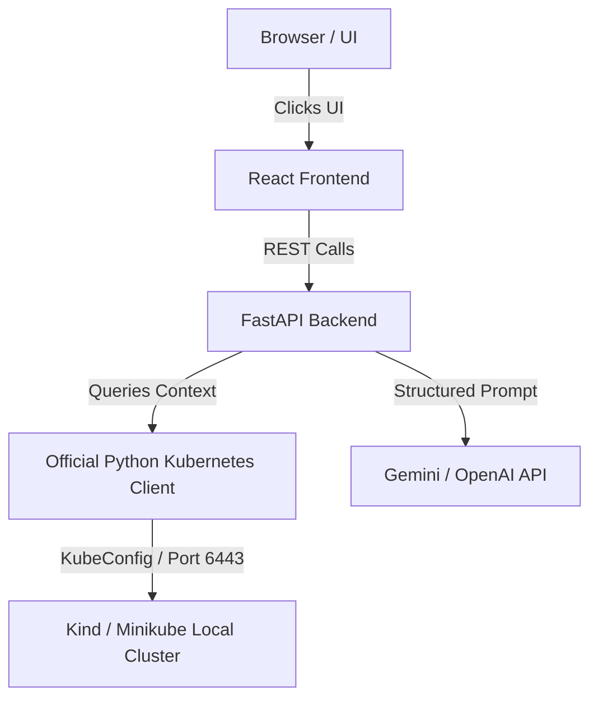

# Podex Architecture

This document describes the high-level design of Podex.

## Structure Overview

Podex is designed to run entirely on a local laptop using Docker and Docker Compose. It links directly to your local Kubernetes context (like Kind or Minikube).

## Critical Architectural Decisions

1. **Context-Aware AI**: The AI receives structured status summaries, recent events, and container log lines prepared by the backend rather than raw JSON.
2. **Local Cluster Connectivity inside Docker**: When the backend runs in a Docker container, it loads the host's `.kube/config` and in-memory patches references pointing to `localhost` or `127.0.0.1` to route to `host.docker.internal` (and bypasses SSL checks).
3. **Mock Fallback**: If no AI API keys are configured, the backend falls back to a sandbox Mock provider so that the app is fully usable for students instantly upon `docker compose up`.
